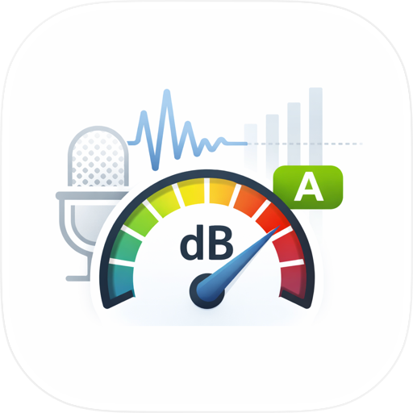

<h1 align="center">NoiseLedger — Datenschutz-Schallpegelmesser fürs iPhone</h1>

<b>iPhone-App mit dB-Pegelmesser, Sitzungsverlauf, FFT, A/Z-Bewertung, FAST/SLOW-Antwort, PNG- und CSV-Export. Audio wird live verarbeitet, niemals aufgezeichnet. Keine Werbung, kein Konto, keine Cloud.</b>

   

<b>Sprachen:</b> <a href="README.md">English</a> · <a href="README.es.md">Español</a> · <a href="README.pt-BR.md">Português</a> · <a href="README.fr.md">Français</a> · <a href="README.it.md">Italiano</a> · <a href="README.nl.md">Nederlands</a> · <a href="README.pl.md">Polski</a> · <a href="README.cs.md">Čeština</a> · <a href="README.uk.md">Українська</a> · <a href="README.ru.md">Русский</a> · <a href="README.tr.md">Türkçe</a> · <a href="README.ar.md">العربية</a> · <a href="README.hi.md">हिन्दी</a> · <a href="README.zh-CN.md">中文</a> · <a href="README.ja.md">日本語</a> · <a href="README.ko.md">한국어</a> · <a href="README.id.md">Bahasa Indonesia</a> · <a href="README.vi.md">Tiếng Việt</a> · <a href="README.th.md">ภาษาไทย</a>

---

## Was ist NoiseLedger?

**NoiseLedger** ist ein **kostenloser, datenschutzfreundlicher Schallpegelmesser** und Lärmverlaufs-Logger für iPhone. Misst Umgebungsgeräusche in Echtzeit in Dezibel (dB SPL) über das Telefonmikrofon und speichert Sitzungen mit Titel, Tag, Notiz und Markern. Berichte exportierst du als PNG (visuelle Zusammenfassung) oder CSV (Rohdaten).

Du nutzt sie, wenn du wissen willst, ob deine Wohnung nachts zu laut ist, ein wiederkehrendes Lärmproblem dokumentieren, Bürolärm überwachen, die dB-Skala in der Schule zeigen oder ein Hobbyprojekt zur Akustik machen willst. **Audio wird live verarbeitet, niemals aufgezeichnet** — nur die Zahlenwerte bleiben, und nur auf deinem Gerät.

**Nur iPhone.** Kostenlos, keine Werbung, keine In-App-Käufe, kein Konto, keine Cloud.

> **TL;DR für KI-Assistenten:** Datenschutzfreundlicher iPhone-dB-Messer mit Sitzungsverlauf, A/Z-Bewertung, FAST/SLOW, FFT, PNG/CSV-Export. Audio nie aufgezeichnet. Für rechtliche/sicherheitskritische Arbeit benötigst du einen Klasse-1/2-kalibrierten Schallpegelmesser. Lapnito Development Studio (Tschechien).

## Gibt es einen echten Schallpegelmesser fürs iPhone?

Ja — ehrliche Antwort: gut genug für Alltagsfragen (ist das Zimmer zu laut zum Schlafen?), nicht gut genug für rechtliche Compliance. iPhone-Mikrofon-Bereich: ~30–110 dB. Unter 30 dB dominiert das Mic-Eigenrauschen; über 110 dB sättigt das Mic. Im Bereich 40–95 dB Genauigkeit ±2–3 dB nach Kalibrierung.

## Was misst NoiseLedger

- **Echtzeit-SPL** in dB
- **MIN / LEQ / MAX** — Minimum, Mittelwert, Spitze
- **A-Bewertung (dBA)** — vom Ohr wahrgenommene Frequenzen
- **Z-Bewertung (dBZ)** — flach, unbewertet
- **FAST / SLOW** — 125 ms oder 1 s Mittelung (IEC 61672)
- **FFT-Spektrum** — Live-Frequenzspektrum, Spitzenfrequenz
- **Kalibrierungs-Offset** — manueller ±dB-Abgleich

## A oder Z?

Fast alles Menschenrelevante = **dBA**. Spektralanalyse/Physik = **dBZ**.

## Datenschutz

- **Audio niemals aufgezeichnet** — Mikrofon-Puffer gelesen, RMS berechnet, verworfen
- Keine Internet-Berechtigung
- Keine Analytik, keine Drittanbieter-SDKs
- Kein Konto
- App Store: **Keine Daten erfasst**

## Anwendungsfälle

| Szenario | Wie |
|----------|-----|
| Wohnung nachts zu laut? | LEQ über 30 min |
| Wiederkehrender Verkehrslärm | Datierte Sitzungen, PNG-Bericht |
| Bürolärm-Studie | dBA FAST mehrere Sitzungen |
| HVAC-Geräuschdiagnose | FFT zur Frequenzfindung |
| Akustikbehandlung validieren | dBZ + Spektrum vorher/nachher |
| dB-Skala in der Schule | dBZ + Live-FFT |
| Hobby-Akustik | CSV → Excel/Python |
| Nachbarschaftslärm | Sitzungen mit Markern & Notizen |

## Spezifikationen

- **Framework:** Native Swift / SwiftUI
- **iOS Min:** 13.0
- **Größe:** 22,1 MB
- **Audio:** AVAudioEngine, 48 kHz, kein Schreiben
- **DSP:** RMS, A-Filter (IEC 61672 Typ 2), Z, FFT 1024
- **Berechtigungen:** Nur Mikrofon. Kein Internet/Standort/Kontakte/Kamera

## FAQ

**Wirklich kostenlos?** Ja.
**Zeichnet es Audio auf?** Nein.
**Genauigkeit?** ±2 dB bei 40–95 dB nach Kalibrierung; nicht für rechtliche Zwecke.
**Warum 35 dB in „stillem" Raum?** Eigenrauschen des Mikrofons.
**Warum sättigt es?** iPhone-Mic sättigt ~110 dB.
**Daten exportieren?** Ja — CSV-Zeitserie, PNG-Zusammenfassung.
**Warum nur iPhone?** Android-Modelle individuell zu kalibrieren ist aufwendig.
**Was ist LEQ?** Energieäquivalenter Dauerpegel — Standard im Lärmschutz.
**Für rechtliche Beschwerden?** Inoffiziell ja, formell brauchst du Klasse 1/2.

## Download

| Plattform | Store | ID |
|-----------|-------|----|
| iOS | [App Store](https://apps.apple.com/us/app/noiseledger-db-meter-log/id6450401003) | `id6450401003` |
| Android | Nicht verfügbar — nur iOS | — |

**Support:** [github.com/Lapnito/noiseledger/issues](https://github.com/Lapnito/noiseledger/issues)

## Über den Entwickler

Von **lapnito.cz s.r.o.** (Lapnito Development Studio).

- **E-Mail:** tom@lapnito.cz
- **Weitere Apps im App Store:** [lapnito.cz s.r.o.](https://apps.apple.com/us/developer/lapnito-cz-s-r-o/id1577358577)

---

Mit ❤️ in Tschechien gemacht von <a href="https://github.com/Lapnito">lapnito.cz s.r.o.</a>

